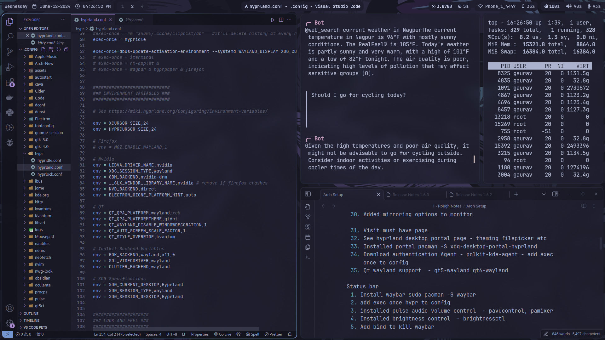
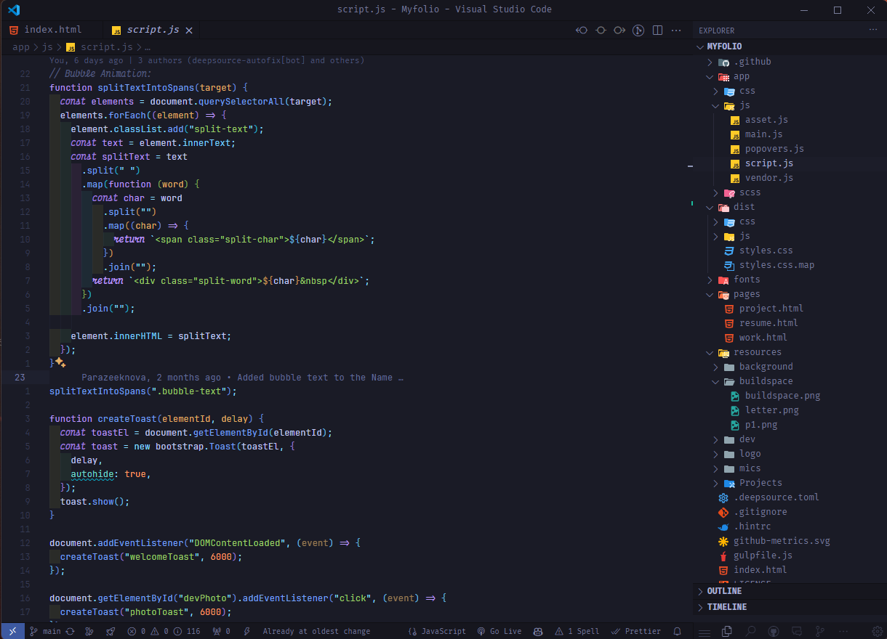

  

   

  <a href="#installation"><kbd>   Installation   </kbd></a>&ensp;&ensp;
  <a href="#documentation"><kbd>   Documentation   </kbd></a>&ensp;&ensp;
  <a href="#keybindings"><kbd>   Keybindings   </kbd></a>&ensp;&ensp;
  <a href="#credits"><kbd>   Credits   </kbd></a>

<figure>
  <figcaption> By the end of this dotfile configs, you'll have a clean and functional setup like these: </figcaption>
  
  <figcaption>i3wm workflow</figcaption>

  
  <figcaption>hyprland workflow</figcaption>
</figure>

## About 🚀
This repository contains my dotfiles for my Arch Linux system (i3 and hyprland), which I use as a Computer Science undergraduate. This repository serves both as a backup for my configuration files and as a guide for others who wish to replicate my setup.

## VSCode Configuration (NeoVim) 📝
<figure>
  <figcaption> Uses VSCode Neovim extension </figcaption>
  
  <figcaption>Removed UI elements with apc Customize UI ++</figcaption>
</figure>

## Documentation 📚
The documentation is divided into the following sections:
1. [Prerequisites](.github/docs/prerequisites.md)
2. [Installation](.github/docs/installation.md)
3. [Configuration](.github/docs/configuration.md)
4. [Customization](.github/docs/customization.md)
5. [Summary](.github/docs/summary.md)

## Credits

Copyright © 2024 Parazeeknova
