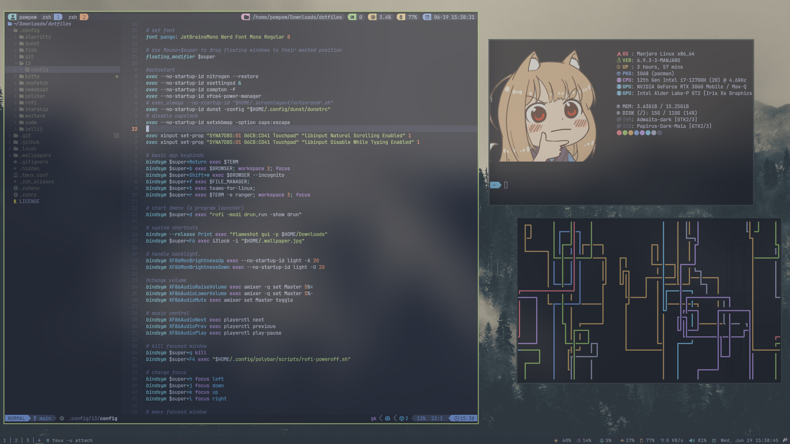

<p align="center">
  <a href="https://github.com/parazeeknova/dotfiles/">
    
  </a>
</p>

<p align="center">
  <a href="#about">About</a> |
  <a href="#installation">Installation</a> |
  <a href="#Credits">Credits</a>
</p>

## About



This repository contains my dotfiles for my Arch Linux system, which I use as a Computer Science undergraduate. This repository serves both as a backup for my configuration files and as a guide for others who wish to replicate my setup.

> [!NOTE]
> This repository is a work in progress, and I will be updating it as I make changes to my system.

Details about my workflow :
- Linux Distribution : Arch Linux
- Window Manager : [i3wm](https://i3wm.org/)
- Bar : [Polybar](https://github.com/polybar/polybar)
- Terminal Emulator : [Alacritty](https://github.com/alacritty/alacritty)
- Another Terminal Emulator : [Kitty](https://sw.kovidgoyal.net/kitty/)
- Shell : [Zsh](https://www.zsh.org/)
  - Editor : [Neovim](https://neovim.io/)
  - Neovim configuration : [lazyvim](https://www.lazyvim.org/)
  - Multiplexer : [Tmux](https://github.com/tmux/tmux)
  - Prompt : [zimfw](https://zimfw.sh/)
- Compositor : [Picom](https://github.com/yshui/picom)
- File  Manager : [Thunar](https://docs.xfce.org/xfce/thunar/start)
- CLI System Monitor : Neofetch

## Installation

> [!CAUTION]
> Settings applied by this repository are personal, and definitely not suite everyones needs. Don’t blindly use my settings unless you know what that entails. Use at your own risk!

### Arch Linux
```bash
sudo pacman -S stow
```

To other distros, install `stow` using your package manager.

### Setup

Clone the repository to your home directory.

Use stow to symlink the configuration files to the respective folders.
```bash
stow <respective-config-folder-name>
```

## To-Do
- [ ] Configure i3lock 
- [ ] Configure rofi for system menus
- [ ] Change mouse cursor

## Credits

Copyright © 2024 Parazeeknova
